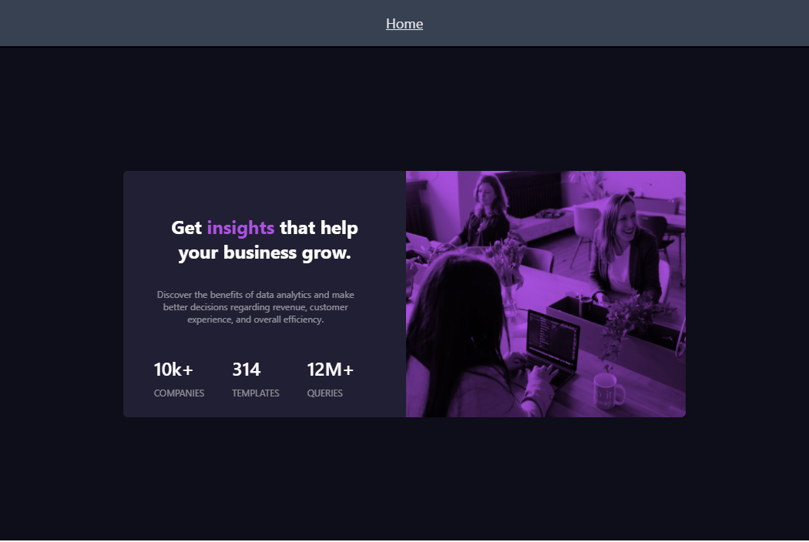

# Frontend Mentor - Stats preview card component solution

This is a solution to the [Stats preview card component challenge on Frontend Mentor](https://www.frontendmentor.io/challenges/stats-preview-card-component-8JqbgoU62). Frontend Mentor challenges help you improve your coding skills by building realistic projects.

## Table of contents

- [Overview](#overview)
  - [The challenge](#the-challenge)
  - [Screenshot](#screenshot)
  - [Links](#links)
- [My process](#my-process)
  - [Built with](#built-with)
  - [What I learned](#what-i-learned)
  - [Continued development](#continued-development)
- [Author](#author)

**Note: Delete this note and update the table of contents based on what sections you keep.**

## Overview

### The challenge

Users should be able to:

- View the optimal layout depending on their device's screen size

### Screenshot



### Links

- Solution URL: [GitHub](https://github.com/PacoZG/frontend-mentor/tree/master/src/Challenge1)
- Live Site URL: [Vercel deployment](https://frontend-mentor-sage.vercel.app/stats_preview)

## My process

### Built with

- Semantic HTML5 markup
- Flexbox
- CSS Grid
- Mobile-first workflow
- [React](https://reactjs.org/) - JS library
- [Next.js](https://nextjs.org/) - React framework
- [React Bootstrap](https://react-bootstrap.github.io/) and [Tailwindcss](https://tailwindui.com/) - For styles

### What I learned

I mainly used many of the tool and skills learn in the course [Full Stack 2021](https://fullstackopen.com/) and others that I learn by working in personal project. But I learn how to work with Carousel from React Bootstrap and mix blend from tailwind like in portion oc html code below:

```html

```

### Continued development

I will integrate all the challenges in one [vercel deployment](https://frontend-mentor-sage.vercel.app) on which all of them will be visible and easy to find

## Author

- Website - [Francisco Zavala](https://pacoder-cv.vercel.app/)
- Frontend Mentor - [@PacoZG](https://www.frontendmentor.io/profile/PacoZG)
- LinedIn - [francisco-zavala](https://www.linkedin.com/in/francisco-zavala/)
- GitHub - [PacoZG](https://github.com/PacoZG)
